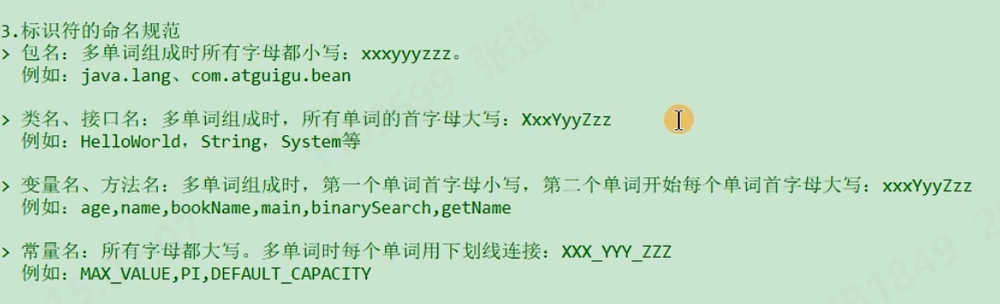
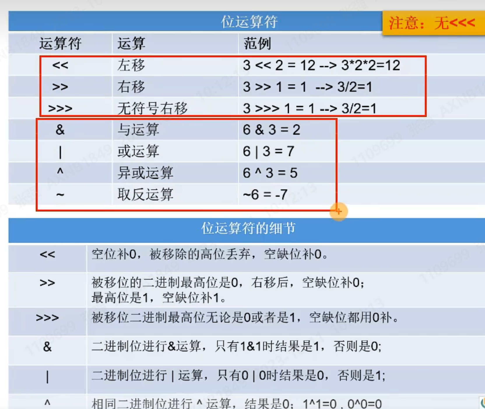
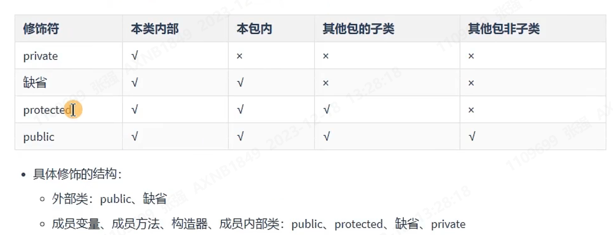
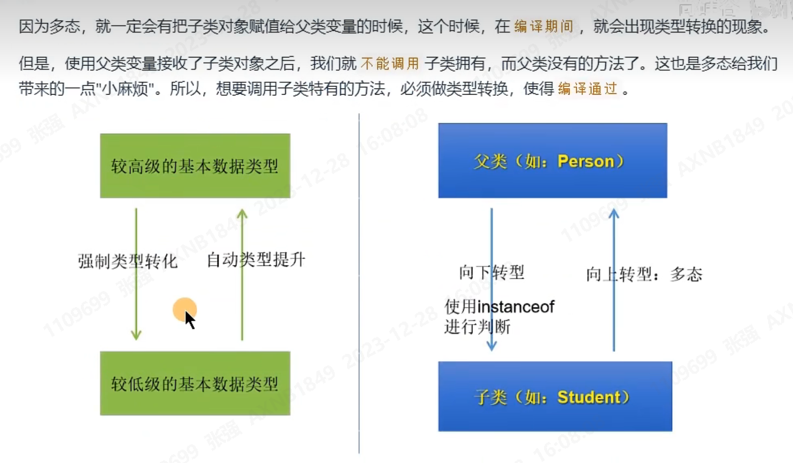

# 1 java概述
## 1.1 JDK JRE JVM的关系
JDK：Java开发工具包
JRE：Java运行环境
JVM：Java虚拟机
JDK包含JRE包含JVM
## 1.2 Java中的类
Java中可以有多个类，但是只能有一个Public class，且该class必须要和文件名一致
# 2 变量与标识符
## 2.1 关键字与字面量
关键字有特殊含义，不可作为标识符使用；字面量同理：null true false
## 2.2 标识符及命名规范
凡是自己起名字的地方均为标识符
不可数字开头；区分大小写；不能包含空格；26个字母、数字、$或_
标识符命名规范如下图：


## 2.3 变量
为什么需要变量？
变量是程序不可或缺的组成单位，最基本的存储单元。
概念：内存中的一个存储区域，该区域数据可以在同一类型范围内不断变化。
### 2.3.1 变量的基本使用
1. 变量的理解：存储在内存中，数据类型范围内可变
2. 三要素：数据类型、变量名、存储值
3. Java中的声明格式：数据类型 变量名 = 变量值
4. Java中的变量按照数据类型来分类：
基本数据类型（8种）：
整型：byte\short\int\long
浮点型：float\double
字符型：char
布尔型：boolean
引用数据类型：
类(class)
数组(array)
接口(interface)
枚举(enum)
注解(annotation)
记录(record)
注：
* Java中每个变量必须先声明，后使用
* 变量有作用域，出了作用域变量不起作用(可用全局) ，同一个作用域内不能声明两个同名的变量
* 变量在赋值时，必须满足数据类型且不能超过类型范围
  
## 2.4 基本数据类型介绍
### 2.4.1 整型使用
* 定义long类型的变量，赋值时需要以'l'或者'L'作为后缀
* Java程序中变量通常声明为int型，除非不足以表示较大的数，才使用long
* Java整型常量默认为int

### 2.4.2 浮点类型:float,double
* float,单精度，尾数可以精确到7位有效数字
* double，双精度，精度是float的两倍，通常采用此类型
* 定义float类型的变量，赋值时需要以'f'或者'F'比较
#### 关于浮点数精度的说明
* 并不是所有的小数都能可以精确用二进制浮点数表示，二进制浮点数不能精确的表示10的负次幂
* 浮点类型的数据不适合在不容许舍入误差的金融计算领域。如果需要精确数字计算或保留指定位数的精度，需要使用BigDecimal类

### 2.4.3 字符类型：char
* char型数据用来表示通常意义上的字符
* Java中所有字符都使用Unicode编码，故一个字符可以存储一个字母，一个汉字，或其他书面语的一个字符
* 字符型变量的三种表现形式：
    - 形式1：使用单引号括起来的单个字符；
    - 形式2：直接使用Unicode值来表示字符型常量：'\uXXXX'，其中XXXX为一个十六进制整数。
    - 形式三：Java中还允许<font color='Blue'>"转义字符"</font>来将其后的字符转变为特殊字符型常量.
    - 形式四：使用具体字符对应的数值（比如ASCII码）
### 2.4.4 布尔类型：boolean
* boolean类型用来判断逻辑条件，一般用于流程控制语句中：
  - if条件控制语句；
  - while条件控制语句；
  - for循环控制语句；
  - do-while循环控制语句
* boolean类型数据只有两个值：true、false，无其他
  - 不可以使用0或者非0整数替代false和true。
### 2.4.5 基本数据类型变量之间的运算规则
* 这里提到的可以做运算的基本数据类型有7种，不包含boolean类型。
* 运算规则包括：
  - 自动类型提升：当容量小的变量与容量大的变量做运算时，结果自动转换为容量大的数据类型。此时的容量的小或大，并非指占用空间的大小，而是指表示数据的范围的大小。
  特别注意：byte、short、char类型的变量之间做运算，结果为int类型。
  - 强制类型转换
## 2.5 基本数据类型与String的运算
### 2.5.1 关于String的理解
* String类，属于引用数据类型，俗称字符串
* String类型的变量，可以用一对一""的方式赋值
* String声明的字符串内部，可以包含0个，1个和多个字符
### 2.5.2 String与基本数据类型变量的运算
* 这里的基本数据类型变量包括boolean在内的8种。
* String与基本数据类型变量之间只能做连接运算，使用“+”表示。
* 运算结果是String类型
## 2.6 计算机底层如何存储数据
### 2.6.1 进制的分类
* 十进制：0~9 二进制：0-1，以0b或者0B开头 八进制：0-7，满8进1，以0开头 十六进制：数字组成：0-9，a-f 满16进1，以0x或者0X开头，a-f不区分大小写
### 2.6.2 十进制和二进制的转换
* 计算机的存储使用二进制补码形式存储，并且最高位是符号位
    - 正数：最高位是0
    - 负数：最高位是1
* 正数的三码合一：原码、反码、补码
* 负数的三码不一样：
  * 负数的原码：把十进制转换为二进制，然后最高位设置为1
  * 负数的反码：在原码的基础上，符号位不变，其他位取反
  * 负数的补码：反码+1
使用补码表示有符号整数可以消除零的符号性，并且在进行运算时可以统一处理正负数。此外，补码还具有一个重要的特性，即在计算机中使用固定位数表示整数，补码能够更好地利用数值范围，使得最高位可以同时表示符号和数值，不会浪费一个数值表示位。
因此，原码、反码和补码是计算机中常用的表示有符号整数的方式，通过补码表示法，计算机可以进行高效的整数运算，同时充分利用了有限的二进制位来表示整数范围。
* 计算机底层存储的是补码，故求负数的补码对应的数值时，取反加一等价于减一取反，故对补码求补码，就能得到原码
## 2.7 运算符
### 2.7.1 算数运算符
* 取模运算时，结果符号与被模数相同
* 前++，先自增1，后运算；后++，先运算，后自增1
* 前--，先自减1，后运算；后--，先运算，后自减1
* 自增/自减运算不改变本身变量的数据类型
```java
int m = 2;
int m = m++;
System.out.println(m); // 2
```
上述结果为1的原因是计算时会先取值2放入操作数栈，m再自增，此时m=3，再把操作数栈中的2赋值给m，故m=2
### 2.7.2 赋值运算符
* 基本语法：变量 = 表达式，当=两边数据类型不一致时，可以使用自动类型转换或使用强制类型转换原则进行处理。
* 支持连续赋值
* 扩展赋值运算符：+=，-=，*=，/=，%=
* +=，-=，*=，/=，%=不会改变变量本身的数据类型。
### 2.7.3 比较（关系）运算符
* 比较运算符的结果是boolean类型
* \> < >= <=:只适用于基本数据类型(除boolean外)
* == !=：适用于基本数据类型和引用数据类型
* 注意区分==和=
### 2.7.4 逻辑运算符
* 逻辑运算符，操作的都是boolean类型的变量或常量，而且运算的结果也是boolean类型
* 运算符说明：
  * &和&&：表示“且”关系，当符号两边的布尔值都为true时，整体结果才为true，否则为false。&&具有短路效果，即如果第一个表达式为false，则不再计算第二个表达式。
  * |和||：表示“或”关系，当符号两边的布尔值有一边为true时,结果为true；当两边都为false时，整体结果才为false。||具有短路效果，即如果第一个表达式为true，则不再计算第二个表达式。
  * !:表示“非”关系，用来对布尔值进行取反。
  * ^:表示“异或”关系，当符号两边的布尔值相异时，结果为true，否则为false。
    * 理解：异或，追求的是“异”！
* 逻辑运算符用于连接布尔表达式，在Java中不可以写成3<a<6,应该写成3<a && a<6。
### 2.7.5 位运算符(难点、非重点)
#### 基本语法
  
### 2.7.6 条件运算符
#### 基本语法
* 条件运算符格式：
```java
(条件表达式)?表达式1:表达式2
```
* 说明：条件表达式是boolean类型的结果，根据boolean的值选择表达式1或表达式2
* 如果运算后的结果赋给新的变量，要求表达式1和表达式2为同种或兼容的类型。
* 开发中，凡是可以使用条件运算符的位置，都可以改写为if-else。反之，能使用if-else结构，不一定能改写为条件运算符。

# 3 流程控制语句
## 3.1 顺序结构
* 注意变量定义于使用之前即可

## 3.2 分支结构
### 3.2.1 分支结构1：if-else条件判断结构
 * 1. 格式
 * 格式1:
 ```java
 if(条件表达式){
    语句块1;
 }
 ```
 * 格式2:
 ```java
 if(条件表达式){
    语句块
 }else{
    语句块2;
 }
 ```
 * 格式3:
 ```
 if(条件表达式1){
    语句块
 }elif(条件表达式2){
    语句块2;
 }
 ...
elif(条件表达式n){
    语句块n;
 }else{
    语句块n+1;
 }
 ```
 ### Scanner类获取键盘输入
 * 注意：没有提供获取char类型变量的方法，需要使用Scanner类next().charAt(0)

### 3.2.2 switch-case选择结构
#### 3.2.2.1 基本语法
* 语法格式：
```java
switch(表达式){
   case 常量值1;
   语句块1;
   // break;
   case 常量值2;
   语句块2;
   // break;
   // ...
   [default:
   语句块n+1;
   /break;]
}
```
* 执行过程：根据表达式中的值，依次匹配case语句。一旦与某个case中的常量相等，那么就执行case中的执行语句。执行完此执行语句后：
  *  情况1：遇到break则执行break后跳出当前的switch-case结构 --> case穿透
  *  没有遇到，则继续执行其后case中的执行语句。
* 说明：
   * switch中的表达式只能是特定的数据类型，如下：byte\short\char\int\枚举\String
   * case后都是跟的常量，使用表达式与这些常量做相等的判断，不能进行范围的判断。

### 3.2.3 循环结构
* 理解：循环语句具有在某些条件满足下，反复执行特定代码的功能。
* 分类：
  * for循环
  * while循环
  * do-while循环
* 循环结构的4个要素：
  * 初始化部分
  * 循环条件部分
  * 循环体部分
  * 迭代部分
#### 3.2.2.1 for循环
* 语法格式：
```java
for(①初始化部分;②循环条件部分;③④迭代部分){
   ③循环体部分;
}
```
#  6 面向对象编程（基础）
学习面向对象内容的三条主线
 *  Java类及类的成员：（重点）属性、方法、构造器；（熟悉）代码块、内部类
 *  面向对象的特征：封装、继承、多态、（抽象）
 *  其他关键字的使用：this、super、static、final、abstract、interface、package、import
## 6.1 面向对象编程概述（了解）
### 6.1.1 程序设计的思路
   面向对象，是软件开发中的一类编程风格、开发范式。除了面向对象，还有面向过程、指令式编程和函数式编程。在所有的编程范式中，接触最多的还是面向对象和面向过程。
   早期先有面向过程思想，随着软件规模的扩大，问题复杂性的提高，面向过程的弊端越来越明显，出现了面向对象思想并成为目前主流的方式。
1.面向过程的程序设计思想，简称POP
2.面向过程的程序设计思想，简称OOP
### 6.1.2 由实际问题考虑如何设计程序
面向对象可以从宏观上把握、从整体上分析整个系统，但具体到实现部分的围观操作，仍然需要面向过程的思路去处理。两者是相辅相成的。
## 6.2 Java语言的的基本元素：类和对象
### 6.2.1 引入
### 6.2.2 类和对象概述
类(Class)和对象(Object)是面向对象的核心概念。
1、什么是类
类：具有相同特征的事物的抽象描述，是抽象的、概念上的定义。
2、什么是对象
对象：实际存在的该类事物的每个个体，是具体的，因而也称为实例(instance)。
### 6.2.3 类的成员概述
面向对象程序设计的重点是‘类的设计’
类的设计，其实就是类的成员的设计
类是一组相关属性和行为的集合，这也是类最基本的两个成员。
* 属性：该类事物的状态信息。对应类中的成员变量。
  * 成员变量<=>属性<=>Field(字段、域)
* 行为：该类事物要做什么操作，或者基于事务的状态能够做什么。对应类中的成员方法。
  * 成员方法<=>行为<=>Method
面向对象完成具体功能的操作的三步流程
* 步骤1：创建类，并设计类的内部成员（属性、方法）
* 步骤2：创建类的对象
* 步骤3：通过“对象.属性”或“对象.方法”调用对象的属性和方法，完成相关的功能
### 6.2.4 类的实例化剖析、内存解析
* 对象在内存中的分配涉及到的内存结构
- 栈(stack)：方法内定义的变量，存储在栈中
- 堆(heap)：new出来的结构（数组的实体，对象的实体），包括对象中的属性
- 方法区(method area)：存放类的模板。比如说：Person类的模板。
* 创建类的多个对象时，每个对象在堆空间中有一个对象实体。每个对象实体中保存着一份类的属性。
* 当Person p3 = p1;时，p1,p3指向的是同一个内存地址，无论修改哪个的属性都会影响另一个。
### 6.2.5 类的成员之一：成员变量(属性)
* 属性的几个称谓：成员变量、属性、field(字段、域)
* 区别成员变量 VS 局部变量
  * 相同点：
    * 变量声明的格式相同
    * 变量都有其有效的作用域，出了作用域即失效
    * 变量必须先声明后赋值
  * 不同点：
    * 类中声明的位置不同
    * 在内存中分配的位置不同（难）
      * 属性：随着对象的创建，会在堆空间中分配实体，占用空间
      * 局部变量：随着方法的调用，会在栈空间中分配空间，占用空间
    * 生命周期：
      * 属性：随着对象的创建而存在，随着对象的消失而消失
      * 局部变量：随着方法对应的栈帧入栈，局部变量会在栈中分配；随着方法对应的栈帧出栈，局部变量消亡
    * 作用域：
      * 属性：在整个类中都可以使用
      * 局部变量：在方法(或构造器、代码块中)内使用
    * 是否有权限修饰符的限制
      * 都有哪些权限修饰符：private、public、缺省、protected（用于表明所修饰的结构可调用的范围的大小）
      * 属性：可以在声明属性时，指明其权限，使用权限修饰符
      * 局部变量：不可以使用权限修饰符 
    * 是否有默认值（重点）
      * 属性：都有默认初始化值
          意味着，如果没有给属性进行显式的赋值，那么就会使用默认值。
      * 局部变量：没有默认初始化值
          意味着，如果没有给局部变量赋值，则不能使用，必须赋值后才能使用。 
### 6.2.6 类的成员之二：方法(或函数)
* 方法、使用方法的好处：描述类应该具有的功能。方法是类或对象行为特征的抽象，用来完成某个功能操作。在某些语言中称为函数或过程。
* 将功能封装为方法的目的：可以实现代码重用，减少冗余，简化代码
* Java里的方法不能独立存在，所有的方法必须放在类里。
* 方法声明格式：权限修饰符 [其他关键字/修饰符] 返回值类型 方法名(形参列表) [throws 异常类型]{
                // 方法体 
* }
* 权限修饰符包括：private\ 缺省\ protected\ public
* 返回值类型：描述当调用完此方法时，是否需要返回一个结果。
  * 分类：
    * 无返回值类型 void即可
    * 有返回值类型，需要指明返回的数据的类型，可以是基本数据类型，也可以是引用数据类型
  * 是否返回，具体问题具体分析
* 方法名：属于标识符，满足标识符规定与规范。
* 形参列表：形参，局部变量，且可以声明多个。
  * 格式：(形参类型1 形参1,形参类型2 形参2)
  * 分类：无形参列表、有形参列表
* 真正实现方法功能的代码是方法体
* 方法内可以调用本类中的(其他)方法或属性。
* 方法内不能定义方法。
* return的作用
  * 结束方法
  * 针对于有返回值类型的方法，使用"return 数据"方法返回所要的数据。
### 6.2.7 再谈方法
#### 6.2.7.1 方法重载
  * 定义：在同一个类中，允许存在一个以上的同名方法，只要它们的参数个数或者参数类型不同即可。满足这个条件的多个同名方法，彼此之间构成方法的重载。
  * 总结：两同一不同：同一个类、相同方法名；参数列表不同：①参数个数不同，②参数类型不同。
  * 注意：方法的重载与权限修饰符、返回值类型、形参变量名、方法体都没有关系！
  * 同一个类中不允许定义两个相同的方法。
  * 如何判断两个方法相同？方法名相同，且形参列表相同。（形参列表相同指的是参数个数和类型都相同，与形参名没关系）
#### 6.2.7.2 可变个数形参的方法
  * 使用场景：在调用方法时，可能会出现方法形参的类型是确定的，个数不确定。此时可以使用可变个数形参的方法。
  * 格式 (参数类型 ... 参数名)
  * 说明：
      ① 可变个数形参的方法在调用时，针对于参数个数，从0个开始，到无穷多个都可以处理。
      ② 可变个数形参的方法与同一个类中方法名相同，形参不同的方法之间构成重载。
      ③ 特例：可变个数形参的方法与同一个类中方法名相同，形参类型也相同的数组之间不构成重载。换句话说，二者不能共存。也就是说，这两者编译后是一回事。
      ④ 可变个数形参在方法的形参中，必须声明在末尾。
      ⑤ 可变个数形参在方法的形参中，最多只能声明一个可变形参。
#### 6.2.7.3 方法的值传递机制
* 对于方法内声明的局部变量来说：如果出现赋值操作：
  > 1. 如果局部变量是基本数据类型，此时赋值的是变量所保存的数据值。 
  > 2. 如果局部变量是引用数据类型，此时赋值的是变量所保存的数据的地址值。
* 方法的参数的传递机制，值传递机制（不是引用传递）
* 实参给形参赋值的过程
  > 如果形参是基本数据类型，此时实参赋给形参的是实参真实存储的数据值。
  > 如果形参是引用数据类型，此时实参赋给形参的是实参存储数据的地址值。

  #### 6.2.7.4 递归方法
  * 递归方法调用：方法自己调用自己的现象就称为递归
  * 递归的分类：直接递归、间接递归

### 6.2.8 关键字：package、import
* package（包）
  * 用于指明该文件中定义的类、接口等结构所在的包
  * 一个源文件只能有一个声明包的package语句
  * package语句作为Java源文件的第一条语句出现。若缺省该语句，则指定为无名包。
  * 包名，属于标识符，满足标识符命名的规则和规范（全部小写）、见名知意
    * 包通常使用所在公司域名的倒置：com.atguigu.xxx。
    * 大家取包名时不要使用“java.xx”包
  * 包对应于文件系统的目录，package中使用“.”来指明包(目录)的层次
  * 同一个包下可以声明多个结构(类，接口),但是不能定义同名的结构，不同包下可以定义同名的结构。
  * 包的作用
    * 包可以包含类和子包，划分"项目层次"，便于管理
    * 帮助"管理大型软件"系统,将功能相近的类划分到同一个包中，比如：MVC的设计模式。
    * 解决"类命名冲突"的问题。
    * 控制"访问权限"。
  * JDK中主要的包
    * java.lang：包含Java语言的核心类，如String、Math、Integer、System和Thread等。
    * java.net：包含执行与网络相关的操作的类和接口。
    * java.io：包含能提供多种输入/输出功能的类。
    * java.util:包含一些实用工具类，如定义系统特性、接口的集合框架类、使用与日期日历相关的函数。
    * java.text:包含了一些java格式化相关的类。
    * java.sql:包含了java进行JDBC数据库编程的相关类和接口。
    * java.awt:包含了构成抽象窗口工具集（abstract window toolkits）的多个类，这些类被用来构建和管理应用程序的图形用户界面(GUI)。
* import关键字的使用
  * 为了使用定义在其他包中的Java类，需用import语句来显式引入指定包下需要的类。相当于import语句告诉编译器到哪里去寻找这个类。
  * 语法格式：import 包名.类名;
  * import语句，声明在包的声明和类的声明之间。
  * 如果需要导入多个类或接口，那么就并列显示多个import语句即可。
  * 如果使用“a.*”导入结构，表示可以导入a包下的所有的结构。举例：可以使用java.util.*的方式，一次性导入util下所有类和接口。
  * 如果导入的类或接口是java.lang包下的，或者是当前包下的，则可以省略此import语句。
  * 如果已经导入java.a包下的类，如果需要使用a包下的子包下的类的话，仍然需要导入。
  * 如果在代码中使用不同包下同名的类，那么就需要使用类的全类名的方式指明调用的是哪个类。
  * import static的使用，调用指定类或接口下的静态的属性或方法。
### 6.2.9 面向对象特征一：封装性(encapsulation)
#### 6.2.9.1 为什么需要封装性
* 客观世界里每一个事物的内部信息都隐藏其内部，外界无法直接操作和修改，只能通过指定的方式进行访问和修改。
随着我们系统越来越复杂，类会越来越多，那么类之间的访问边界必须把握好，面向对象的开发原则要遵循“高内聚，低耦合”。
而“高内聚，低耦合”的体现之一：
* 高内聚:类的内部数据操作细节自己完成；
* 低耦合：仅暴露少量的方法给外部使用，尽量方便外部调用。
#### 6.2.9.2 何为封装性
* 所谓封装，就是把客观事物封装成抽象概念的类，并且类可以把自己的数据和方法只向可信的类或者对象开放，向没必要开放的类或者对象隐藏信息。
通俗的讲，把该隐藏的隐藏起来，该暴露的暴露出来。这就是封装性的思想。
#### 6.2.9.3 Java如何实现数据封装
* 4种权限修饰符：private、缺省、protected、public，我们可以使用4种权限修饰，来修饰类及类的内部成员，当这些成员被调用时，体现可见性的大小。
* 四种权限修饰符的具体访问范围及具体修饰的结构如下：
  
* 开发中4种权限修饰符的使用情况：
  * 比较高：public，private
  * 比较低：缺省，protected
* 封装性的体现：
  >  场景1：私有化类的属性，提供公共的get和
  set方法，对此属性进行修改或获取
  >  场景2：将类中不需要不对外暴露的方法设置为private即可。
  >  场景3：单例模式中构造器设置为private，避免在类的外部创建实例。

### 6.2.10 类的成员之三：构造器(constructor)
* 构造器的作用：
  * 搭配new关键字，创建类的对象
  * 在创建对象的同时，可以给对象的相关属性赋值
* 构造器声明格式：
  > 权限修饰符 类名(形参列表){}
  > 创建类以后，在没有显式提供任何构造器的情况下，系统会默认提供一个空参的构造器，且构造器的权限和类声明的权限相同
  > 一旦类中显式声明了构造器，则系统不再提供默认的空参的构造器。
  > 一个类中定义的多个构造器，彼此构成重载。 

### 6.2.11 实例变量赋值过程和UML类图
#### 6.2.11.1 类中属性(当前只考虑实例变量)赋值过程
  * 在类的属性中，可以有哪些位置给属性赋值？
    * ① 默认初始化；
    * ② 显式初始化；
    * ③ 构造器中初始化；
    * ④ 通过对象.方法赋值；
    * ⑤ 通过对象.属性赋值。
  * 这些位置的先后顺序是怎样的？
    * ① - ② - ③ - ④/⑤
  * 以上操作在对象创建过程中可以执行的次数如何？
    * 前三种只执行1次，后两个可以多次执行

#### 6.2.11.2 JavaBean的理解
  * JavaBean是一种Java语言写成的可重用组件。
  * 所谓JavaBean，是只符合如下标准的Java类：
    * 类是公共的
    * 有一个无参的公共的构造器
    * 有属性，且有对应的get、set方法
  * 用户可以使用JavaBean将功能、处理、值、数据库访问和其他可以用Java代码创建的对象进行打包，并且其他开发者可以通过内部的JSP页面、Servlet、其他JavaBean、applet程序或者应用来使用这些对象。用户可以认为JavaBean提供了一种随时随地的复制粘贴的功能，而不用关心任何改变。

#### 6.2.11.2 UML类图
  * 常用UML工具软件有PowerDesigner、Rose和Enterprise Architect等。
  * UML工具软件不仅可以绘制软件开发中所需的各种图表，还可以生成对应的源代码。
  * 在软件开发中，使用UML类图可以更加直观的描述类内部结构(类的属性和操作)以及类之间的关系(如关联、依赖、聚合等)
    * +表示public类型，-表示private类型，#表示protected类型
    * 方法的写法：
      方法名的类型(+、-)方法名(参数名: 参数类型): 返回值类型
    * 斜体表示抽象方法或类。

# 7 面向对象编程(进阶)
## 7.1 关键字this
### 7.1.1 this关键字是什么？
* 在Java中，this关键字不算难理解，它的作用和其语义相近。
  * 它在方法中(准确说是实例方法或非static方法)内部使用，代表调用该方法的对象。 
  * 在构造器内部使用，表示该构造器正在初始化的对象。
* this可以调用的结构：成员变量、方法、构造器
* this的理解：当前对象(在方法中调用时)或正在创建的对象(在构造器中调用时)
* 针对方法内的使用情况(准确的说是非static修饰的方法)：
  * 一般情况：我们通过对象调用方法，可以在方法内调用当前对象的属性或其他方法。此时我们可以在属性和其他方法前使用“this.”，表示当前属性或方法所属的对象。但是，一般情况下，我们都选择省略。
  * 特殊情况：当方法形参与对象属性同名，必须使用this.进行区分，使用this.修饰的即为成员变量(属性)。没有修饰的即为局部变量。
* 针对构造器内部的使用情况
  * 一般情况：我们通过构造器创建对象时，可以在构造器内调用当前正在创建的对象的属性或其他方法。此时我们可以在属性和其他方法前使用“this.”，表示当前属性或方法所属的对象。但是，一般情况下，我们都选择省略。
  * 特殊情况：当构造器的形参与正在创建的对象属性同名，必须使用this.进行区分，使用this.修饰的即为成员变量(属性)。没有修饰的即为局部变量。
* this调用构造器：
  > 格式"this(形参列表)"
  > 可以在类中的构造器中，调用当前类中指定的其他构造器
  > 要求"this(形参列表)"必须声明在当前构造器的首行
  > "this(形参列表)"在当前构造器中最多声明一个
  > 如果一个类中有n个构造器，则最多有n-1个构造器可以声明"this(形参列表)"的结构。
## 7.2 面向对象特征二：继承性(inheritance)
### 7.2.1 继承性概述
#### 7.2.1.1 生活中的继承
#### 7.2.1.2 Java当中的继承
**<font color = 'Red'>角度一：从上而下</font>**
* 通过继承，简化定义

**<font color = 'Red'>角度一：从下而上</font>**
* 多个类存在相同属性和行为时，将这些内容抽取到一个类中，那么多个类无需定义这些属性和行为，只要继承那个类即可。
#### 7.2.1.3 继承的好处
* 减少了代码的冗余，提高了代码的复用性
* 继承的出现，更有利于功能的扩展
* 继承的出现让类之间产生了is-a的关系，为多态的使用提供了前提
  * 不要仅为了获取其他类中某个功能而继承！
### 7.2.2 继承的格式
* 格式 class A{}  class B extends A{}
* 继承中的基本概念：类A：父类、基类、超类；类B：子类、派生类
* 有了继承性之后，子类就获取到了父类中声明的所有的属性和方法。
* 但是由于封装性的存在，可能子类不能直接调用父类中声明的属性和方法。
* 子类在继承父类之后，还可以扩展自己特有的功能。（增加特有的属性、方法）
  * extends：延展、扩展、延伸
* java中声明的类，如果没有显式的声明其父类时，则默认父类：java.lang.Object
* 补充：Java中支持多层继承
  * 一个父类可以拥有多个子类
  * Java只支持单继承，不支持多重继承

## 7.3 四种权限修饰测试
* 实际开发过程中，各权限修饰的使用频率是怎样的？public、private是使用频率最高的。
## 7.4 方法重写(overwrite/override)
* 继承父类方法后，父类的方法不太适用子类。
* 子类对父类继承过来的方法进行覆盖、覆写的操作，就称为方法的重写。
* 方法重写遵循的规则
  * ①父类被重写的方法与子类重写方法的方法名和形参列表必须相同
  * ②子类重写方法的权限修饰符不小于父类被重写方法的权限修饰符
    > 子类不能重写父类中声明为private权限修饰的方法
  * ③关于返回值类型：
    > 父类被重写方法的返回值类型为void，则子类重写方法的返回值类型也必须是void
    > 父类被重写方法的返回值类型是基本数据类型，则子类重写方法的返回值类型必须与被重写方法的返回值类型相同
    > 父类被重写方法的返回值类型是引用数据类型(比如类)，则子类重写方法的返回值类型必须与被重写方法的返回值类型相同或是被重写方法类型的子类。
  * ④子类重写方法抛出的异常类型可以与父类被重写方法抛出的异常类型相同，或是父类被重写方法抛出的异常类型的子类。

## 7.5 关键字super
### 7.5.1 为什么需要super关键字
* 子类继承父类后，对父类方法进行重写，那么在子类中，是否还可以对父类被重写方法进行调用？ 可以！
* 子类继承父类后，发现子类和父类中定义了同名的属性，是否可以在子类中区分两个同名的属性？ 可以！
* 以上均使用super关键字即可。
### 7.5.2 super关键字的使用
* super可以用来调用：属性、方法、构造器
#### 7.5.2.1 super调用属性、方法
* 子类继承父类后，可以在子类的方法或构造器中，调用父类声明的属性或方法。(满足封装性的前提下)，调用时使用super.表示调用父类的属性或方法。
* 当出现方法重写以及同名属性时，为了区分必须使用super.声明，显式调用父类被重写方法或父类中的同名属性。
#### 7.5.2.2 super调用构造器
* 子类继承父类时，不会继承父类的构造器。只能通过“super(形参列表)”的方式调用父类指定的构造器。
* 规定：“super(形参列表)”必须声明在构造器首行。
* 结合前述构造器中关于this的规定，“super(形参列表)”和“this(形参列表)”不能同时出现在一个构造器中。
* 如果在子类构造器首行既没有调用"super(形参列表)"和"this(形参列表)",则子类此构造器会默认调用父类中空参的构造器。
* 子类的任何一个构造器中，要么会调用本类中重载的构造器，要么会调用父类的构造器，只能是这两种情况之一。
* 一个类中声明有n个构造器，最多有n-1个构造器中使用了"this(形参列表)"或"super(形参列表)"，但至少有一个构造器使用了"super(形参列表)"。
> 我们通过子类的构造器创建对象时，一定在调用子类构造器的过程中，直接或间接的调用到父类的构造器。
> 也正因为调用过父类的构造器，我们才会将父类中声明的属性或方法加载到内存中，供子类对象使用。

## 7.6 子类对象实例化全过程
* 从结果的角度看：体现为类的继承性。当我们创建子类对象后，子类对象就获取了其父类中声明的所有属性和方法，在权限允许的情况下，可以直接调用。
* 从过程的角度看：当我们通过子类的构造器创建对象时，子类的构造器一定会直接或间接的调用到其父类的构造器，而其父类构造器同样会直接或间接的调用到其父类的构造器，直到调用到java.lang.Object类中空参的构造器为止。正因为加载过所有的父类的结构，所以才可以看到内存中有父类中的结构，子类对象才可以考虑进行调用。
* 虽然调用了父类的构造器，但是只创建了一个对象，即为new的子类对象。构造器仅仅是用来初始化当前对象的。

## 7.7 面向对象特征三：多态性
### 7.7.1 多态的形式和体现
#### 7.7.1.1 对象的多态性
理解：一个事物的多种形态。
多态性，是面向过程中最重要的概念，在Java中的体现：对象的多态性：父类的引用指向子类的对象
### 7.7.2 多态的格式
格式：(父类类型:指子类继承的父类类型,或实现的接口类型)
> 父类类型 变量名 = 子类对象;

对象的多态：在Java中，子类的对象可以代替父类的对象使用。所以，一个引用类型变量可能指向(引用)多种不同类型的对象
### 7.7.3 多态的应用
* 多态性的应用：虚拟方法调用。在多态的场景下，调用方法时，编译看左边，运行看右边。即编译时，认为方法是左边声明的父类的类型的方法，执行时，实际执行的是子类重写父类的方法
### 7.7.4 多态的使用前提
* 多态的使用前提：①要有类的继承关系；②要有方法的重写。
### 7.7.5 多态的适用性
* 多态的适用性：适用于方法，不适用于属性。
### 7.7.6 多态的好处和弊端
* 多态的好处：极大的减少了方法的冗余，不需要定义多个重载的方法。
  * 开发中，使用父类做方法的形参，是多态使用最多的场合。即使增加了新的子类，方法也无需改变，提高了扩展性符合开闭原则。
  > 【开闭原则OCP】
  > * 对扩展开放，对修改关闭
  > * 通俗解释：软件系统中的各个组件，如模块(moudules)、类(classes)以及功能(Functions)等，应该在不修改现有代码的基础上，引入新功能。
* 多态的弊端：在多态的场景下，我们创建了子类的对象，也加载了子类特有的属性和方法。但是由于声明为父类的引用，导致我们没有方法直接调用子类特有的属性和方法。
### 7.7.7 向上转型和向下转型
#### 7.7.7.1 为什么要类型转换

#### 7.7.7.2 如何向上或向下转型
* 向上转型：就是多态
* 向下转型：使用强制符，但有可能出现类型转换异常，ClassCastException
#### 7.7.7.3 instanceof关键字
* 为了避免向下转型时出现ClassCastException异常，可以在向下转型之前，先进行instanceof的判断，一旦返回true，就进行向下转型。如果返回false，不进行向下转型。
* 格式：(对象 instanceof 类型)
* 说明：a instanceof A：判断对象a是否是类A的实例。如果是，返回true；如果不是，返回false。
* 如果a instanceof A返回true，则a instanceof superA也返回true，其中，superA是类A的父类。

## 7.8 Object类的使用
### 7.8.1 如何理解根父类
类 java.lang.Object是类层次的根类，即所有其他类的父类。每个类都使用Object作为超类。
* Object类型的变量与除Object以外的任意引用数据类型的对象都存在多态引用
* 所有对象(包括数组)都实现这个类的方法。
  * Object类中没有声明属性
  * Object类提供了一个空参的构造器
* 如果一个类没有特别指定父类，那么默认则继承自Object类。
### 7.8.2 Object类中的方法
* 常用：toString()、equals()
* 了解：clone()(深拷贝)、finalize()(GC回收时调用,jdk8后不建议使用)
* 后续涉及：hashCode()、getClass()、wait()(有重载)、notify()、notifyAll()
### 7.8.3 equals()方法使用
适用性：任何引用数据类型都可以使用。
定义：public boolean equals(Object obj) {return (this == obj);}
> 子类使用说明：自定义的类在没有重写Object中equals()方法的情况下，调用的就是Object类中声明的equals()，比较两个对象的引用地址是否想同。（比较两个对象是否指向了堆空间中的同一个对象实体）
> 对于像String、File、Date和包装类等，它们都重写了Object类中的equals()方法,用于比较两个对象的实体内容是否相等。
> 在开发中，针对于自定义的类，常常会判断两个对象是否equals(),而此时常常判断两个对象的属性值是否相等，通常也需要重写Object方法。
* 如何重写：
  * 手动实现
  * Idea自动生成(推荐)
* 高频面试题：区分==和equals()
  * ==:运算符，使用范围：基本数据类型、引用数据类型
  * ==用于基本数据类型：判断数据值是否相等
  * ==用于引用数据类型：判断地址值是否相等
  * equals()：方法，只能使用在引用数据类型
  * 对于equals，重写和不重写的区别
### 7.8.4 toString()方法使用
* Object类中toString()的定义：public String toString() {return getClass().getName() + "@" + Integer.toHexString(hashCode());}
* 开发中的使用场景：
> 平时我们在调用System.out.println()打印对象引用变量时，实际上就是调用当前对象的toString()方法。
* 子类使用说明：
> 自定义类：在没有重写时，默认调用的是Object类中的toString()方法，返回的是当前对象的地址值。
> 像String、Date、File、包装类等都重写了Object类中的toString()方法，使得在调用对象的toString()时，返回“实体内容”信息。
* 开发中使用说明：
  * 如果不希望返回当前对象的地址值，而是希望返回当前对象的实体内容信息，则可以重写toString()方法。

# 8 面向对象编程(高级)
## 8.1 static修饰成员变量和方法
回顾类中的实例变量：实例变量属于类的属性，各个对象之间不共用。
如果想让一个成员变量被类的所有实例共享，就用static修饰即可，称为类变量(或类属性)。
### 8.1.1 类属性、类方法的设计思想
希望某些属性在内存空间中只有一份；或某些方法调用者与当前类的对象无关，无需创建对象，直接调用即可。这样的属性和方法就可以声明为类属性和类方法。
这样的类方法和类属性，只需要用static修饰即可，所以也称为静态方法和静态变量。
### 8.1.2 static关键字
* static：静态的
* static可以用来修饰：属性、方法；代码块、内部类
### 8.1.3 static修饰属性
#### 8.1.3.1 复习：变量的分类
* 方式一：按照数据类型分：基本数据类型、引用数据类型
* 方式二：按照在类中声明的位置分：
  * 成员变量：按照是否使用static修饰分为：
    > 使用static修饰：静态变量(类变量)
    > 不使用static修饰：实例变量(非静态变量)
  * 局部变量：方法内、代码块内、构造器内、形参、代码块内等
#### 8.1.3.2 静态变量
* 静态变量：static修饰的成员变量，也称为类变量。
* 对比静态变量和实例变量：
  ①个数
  > 静态变量：在内存空间中只有一份，被类的多个对象所共享。
  > 实例变量：类的每一个实例(或对象)都保存着一份实例变量。
  ②内存位置
  > 静态变量：jdk6及之前存放在方法区；jdk7及之后，存放在堆空间
  > 实例变量：存放在堆空间的对象实体中。
  ③加载时机
  > 静态变量：随着类的加载而加载，由于类只会加载一次，所以静态变量也只有一份。
  > 实例变量：随着对象的创建而加载。
  ④调用者
  > 静态变量：可以被类直接调用，也可以使用对象调用。
  > 实例变量：只能使用对象调用。
  ⑤消亡时机
  > 静态变量：随着类的卸载而消亡
  > 实例变量：随着对象的消亡而消亡
#### 8.1.3.3 静态方法
* 随着类的加载而加载
* 可以通过“类.静态方法”的方式，直接调用静态方法
* 静态方法内可以调用静态的属性或静态的方法，而不能调用非静态的属性或方法。
* static修饰的方法内，不能使用this关键字，super关键字
### 8.1.3.4 static的应用案例
* 当当前类的多个实例需要共享此成员变量，且此成员变量的值是相同的，此时属性声明为static，节省内存空间。
* 开发中，常将常量设置为静态的，比如Math.PI
* 方法内操作的变量如果都是静态变量（而非实例变量）的话，则此方法建议声明为静态方法
* 开发中，常常将工具类当中的方法都声明为静态的。比如Arrays、Collections、System等类中的方法。
## 8.2 单例设计模式
### 8.2.1 设计模式概述
设计模式：设计模式在大量实践中总结和理论化之后优选的代码结构、编程风格以及解决问题的思考方式。其是前人工作的总结和提炼，通常，被人们广泛流传的设计模式都是针对某一特定问题的成熟的解决方案。
### 8.2.2 设何为单例模式
所谓类的单例模式，就是采取一定的方法保证在整个的软件系统中，对某个类只能存在一个对象实例，并且该类只提供一个取得其对象实例的方法(静态方法)。
### 8.2.3 实现思路
将类的构造器的访问权限设置为private，不能用new在类的外部产生类的对象，但在类的内部仍可以产生该类的对象。因为在类外部开始还无法得到类的对象，只能调用该类的某个静态方法以返回类内部创建的对象，静态方法只能访问类中静态成员变量，所以指向类内部产生的该类对象的变量也必须定义为静态的。
### 8.2.4 单例模式的两种实现模式
* 饿汉式 提前创建好对象，不管是否需要，类加载时就完成实例化
* 懒汉式 延迟创建对象，真正需要时才创建对象
* 两种模式特点：
  * 饿汉式：“立即加载”，随着类的加载，当前的唯一实例就创建了
  * 懒汉式：“延迟加载”，随着类的加载，不创建唯一实例，当第一次调用getInstance()方法时，才创建唯一实例
* 两种模式优缺点对比：
  * 饿汉式：线程安全，调用效率高，但是不能延迟加载。内存中占用时间长。
  * 懒汉式：线程安全，调用效率不高，但是能延迟加载。内存中占用时间短。
### 8.2.5 单例模式的优点及应用场景
应用场景：任务管理器，回收站，Application，Spring中的Bean默认也是单例的，应用程序的日志应用，数据库连接池
## 8.3 main()的理解
* 语句：public static void main(String[] args) {}
* 理解
  * 理解1：看做是一个普通的静态方法
  * 理解2：看做是程序的入口，格式是固定的，不能改变
* 与控制台进行交互：如何从键盘获取数据？
  * 方式1：使用Scanner
  * 方式2：使用main()方法的形参args进行传值
## 8.4 类的成员之四：代码块
### 8.4.1 代码块(或初始化块)的作用
用来初始化类或对象的信息(即初始化类或对象的成员变量)
### 8.4.2 代码块(或初始化块)的修饰
要么不修饰，要么只能使用static修饰
### 8.4.3 代码块的分类
* 静态代码块：使用static进行修饰
* 非静态代码块：没有使用static进行修饰
### 8.4.4 具体使用
* 静态代码块
  * 随着类的加载而执行
  * 由于类加载只执行一次，进而静态代码块的执行，也只会执行一次。
  * 作用：初始化类的信息
  * 内部可以声明变量、调用属性或方法、编写输出语句等操作
  * 静态代码块的执行要先于非静态代码块的执行
  * 如果声明了多个静态代码块，则按照声明的先后顺序执行
  * 静态代码块内部只能调用静态的属性或方法，不能调用非静态的结构
* 非静态代码块
  * 随着对象的创建而执行
  * 每创建当前类的一个实例，就会执行一次非静态代码块
  * 作用：初始化对象的信息
  * 内部可以声明变量、调用属性或方法、编写输出语句等操作
  * 如果声明了多个非静态代码块，则按照声明的先后顺序执行
  * 非静态代码块内部可以调用静态的属性或方法，也可以调用非静态的属性或方法
## 8.5 实例变量赋值位置与赋值顺序
### 8.5.1 实例变量赋值位置
* ① 默认初始化
* ② 显式初始化  /  ⑤ 代码块中初始化
* ③ 构造器中初始化
*****************
* ④ 有了对象后，通过对象.属性或者对象.方法进行赋值
### 8.5.2 实例变量赋值先后顺序
* ① - ②/⑤ - ③ - ④
### 8.5.3 关于字节码文件中的<init>的简单说明
* <init>方法显示在字节码文件中可以看到。每个<init>方法都对应着一个类的构造器。(类中声明了几个构造器就会有几个init方法)
* 编写的代码中的构造器在编译后都会以<init>方法的方式
## 8.6 final关键字的使用
## 8.7 abstract关键字修饰类、方法
## 8.8 抽象的应用举例与模板方法的设计模式
## 8.9 接口的理解与基本语法
## 8.10 接口的应用举例（体现多态、匿名实现类的创建、面试题）
## 8.11 jdk8，jdk9中接口的新特性
## 8.12 类的成员之五：内部类
## 8.13 枚举类的使用(自定义、enum)
## 8.14 枚举类常用方法、实现接口
## 8.15 注解的理解和三个常用注解
## 8.16 元注解与自定义注解应用举例
## 8.17 JUnit单元测试的使用
## 8.18 包装类的理解、基本数据类型与包装类的转换
## 8.19 基本数据类型、包装类与String类之间的转换


