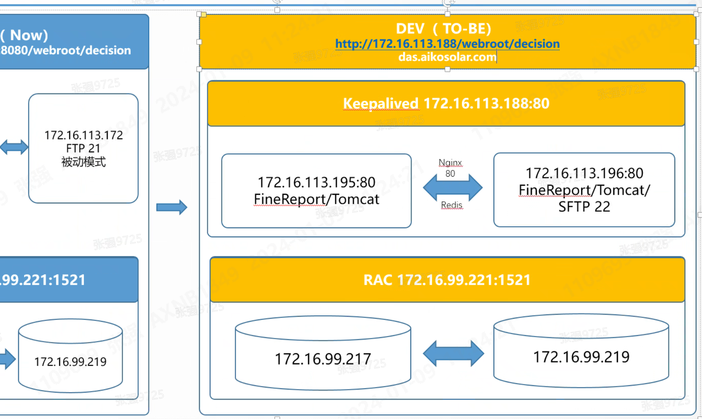

每日顺序：昨日总结->今日刷题->每日学习->工作随来随干
# 本周目标
## 工作
### 任务列表
- [x] 完成报表业务梳理
- [x] 完成安排的指标开发
- [ ] 编写报表的初步业务/技术文档

## 学习
### 任务列表
- [ ] 完成Kafka的收尾
- [x] 完成Kafka集群的搭建与实验
- [x] 开始Java基础的复习/学习，以了解面向对象编程为主
- [x] sql/leetcode每日一题
- [ ] 完成Transformer、Bert、GPT2、GPT3的论文学习(任务较重)
- [x] 对数仓维度建模、范式进一步加深理解
  
## 锻炼
### 任务列表
- [ ] 这周起码锻炼三次/完成1次

# 本周目标（2023/9/4）
## 工作
### 任务列表
- [x] 看板报表工作收尾
- [x] SAP数采脚本看能不能解决，不能解决挂起
- [x] 新报表的开发

## 学习
### 任务列表
- [x] sql/leetcode每日一题
- [x] 列式/行式存储本质上的区别（主要两个层面，业务方面和存储引擎方面）
- [ ] 继续Java基础的学习，以了解面向对象编程为主
- [ ] 完成Transformer（复习）、Bert、GPT2、GPT3的论文学习(任务较重)

### 2023/9/5
* 工作都是小事
* 大数据的框架基本明了，需要进一步加深理解
* Java得多学多学多学
* 多刷算法题

# 本周目标（2023/9/11）
## 学习
### 任务列表
- [ ] sql/leetcode每日一题
- [ ] Java基础学习，加快进度
- [ ] Bert，GPT2，GPT3快速过一遍
- [ ] 大数据框架查漏补缺
- [ ] Kaggle模拟比赛尽量过一遍完整流程

## 工作
### 任务列表
- [ ] 工作随时分配随时完成

# 本周To Do（2023/9/20）
## 学习
### 任务列表
- [x] sql/leetcode每日一题
- [x] Kaggle比赛的流程总结、进一步优化与学习
- [ ] Java基础的深入
- [ ] Transformer复习(Q、K、V的含义，self-attention、多头注意力)
- [ ] Bert的学习

## 工作
### 任务列表
- [x] 最后一张报表的开发
- [x] 前面三张报表的审核，注意数据准确性
- [x] 过往脚本、报表的整理

# 本周To Do（2023/9/25）
## 学习
### 任务列表
- [ ] sql/leetcode每日一题
- [ ] Kaggle比赛的流程总结、进一步优化与学习
- [ ] Java基础的深入
- [ ] Transformer复习(Q、K、V的含义，self-attention、多头注意力)
- [ ] Bert的学习

## 工作
### 任务列表
- [x] 最后一张报表的开发
- [ ] 工作梳理与下一步工作计划

## note
* 加快Java基础的推进！！太慢了
* 工作上的，排个优先级，每天捋一下应该干哪些事情

# 本周To Do（2023/9/20）
## 工作
### 任务列表
- [x] 仓储报表的核对及上线
- [x] 花篮超时片数统计报表的进一步检讨、开发及核对
- [x] 二厂早会报表的进一步核对
- [x] 七厂A级趋势图报表迁移
- [x] SAP相关接口维护及字段更新

## 学习
### 任务列表
- [ ] Java每日一题
- [ ] 注意每天的学习量

### 10/13 事务与规划
- [x] 仓储成品仓的开启、检讨与排期 by10/20
- [x] wip超时片数两张报表的数据核对与上线

# 本周To Do(2023/10/23)
## 工作
### 任务列表
- [x] 仓储报表数据源核对和ETL逻辑
- [x] 二厂成品仓看板开发
- [x] 中英文报表切换

## 学习
### 任务列表
- [ ] spark搭建和压测
- [ ] spark示例和数据处理结合
- [ ] Java推进，结构弄完，开始面向对象
- [ ] 每日一题

# 本周To Do(2023/11/06)
## 工作
### 任务列表
- [x] 仓储报表开发和核对
- [ ] 培训会议PPT及记录
- [x] 中英文切换落地

## 学习
### 任务列表
- [ ] spark及sparkSQL熟练使用
- [ ] Java推进，结构弄完，开始面向对象
- [ ] 每日一题

## note
* 本周注意沟通方式，面对面，脾气小一点
* 注意一下文档总结和梳理
* 自身的源代码管理加强，注意每天的代码提交

### 11/1 事务与规划
- [ ] 本月快速过完spark、flink后，开始学习大数据集群在docker上的搭建
- [ ] k8s和docker，起码懂得怎么用
- [ ] 代码写的太少了，增加每天的代码量

# 本周To Do(2023/11/13)
## 工作
### 任务列表
- [x] 仓储报表上线
- [ ] 仓储四、五厂报表检讨

## 学习（动力不足。。，赶紧学习！）
### 任务列表
- [ ] spark及sparkSQL熟练使用
- [ ] Java推进，结构弄完，开始面向对象
- [ ] 每日一题
- [ ] kafka思考配置和底层原理

### 11/14 事务思考和规划
- [ ] 明天对仓储需求进行检讨梳理，尽量这周五之前完成
- [x] 仓储看板尽快上线，别再拖了
- [ ] 下次仓储看板检讨，先弄清楚需求(需求询问至经理级别)

# 本周To Do(2023/11/20)
## 工作
### 任务列表
- [x] 仓储四、五厂报表检讨
- [x] 成品出入库细分报表开发
- [x] 浆料空桶回收七厂平铺核对

## 学习（动力不足。。，赶紧学习！）
### 任务列表
- [ ] spark及sparkSQL熟练使用
- [ ] Java推进，结构弄完，开始面向对象
- [ ] 每日一题
- [ ] kafka思考配置和底层原理

# 本周To Do(2023/12/18)
## 工作
### 任务列表
- [ ] 答辩ppt，加急，周五之前完成
- [ ] 一厂推送赶紧完成，太墨迹了
- [ ] 看看有无新需求

## 学习
### 任务列表
- [ ] spark深入理解
- [ ] Java面向对象基础本周完成
- [ ] 每日一题
- [ ] flink开始学习

# 本周To Do(2024/1/9)
## 工作
-[] 数据资产、数据字典管理
-[] 数据资产：数据源、数据表、数据字典、数据质量、数据血缘、数据权限
-[] CDH的定位：基地级业务数据仓库
-[] 帆软架构

