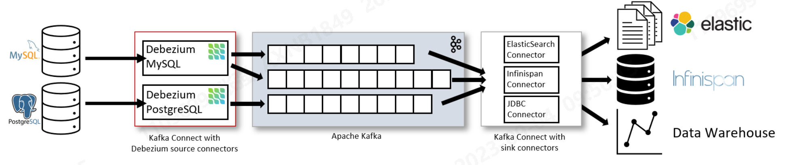

# 流平台相关问题
* 业务，业务，还是他喵的业务？什么业务要需求到实时数据仓库流平台？十点钟要数据，九点和九点半消费没区别，是什么样的业务场景需要流数据？？
* 字段有多少？核心字段是什么？（实时数据仓库每一个字段都有严格的上下游逻辑，因此每个字段最好都细化到负责人的地步）
数据流向有哪些？数据架构图？高核心字段出现异常如何维护？
* 详细的字段逻辑解释，实时和离线不同的是，实时对于表的限制十分严格，要求尽量字段不冗余（冗余是业务需要，但是技术本身需要成本），每一个字段的增删改都会影响到下游数据流，并且上游的数据究竟如何保证不中断也是个很大的问题，因此请给出字段逻辑依据以及每个字段的异常处理方案
* 实时数仓 对于DWM层到底是否有需求？DWD不够你用吗？每一次的分层都涉及到层和层之间的逻辑交互，这个逻辑交互的层级还是秒级甚至毫秒级别的，假如重启了，你的DWM层的数据准不准确呢？
* FlinkCEP，CDC（类似这些业务），是什么场景需要用到，用到了就要保证生产环境的稳定
* 双流JOIN 为什么要用？state怎么设置？FLINK重启了怎么办？你的state期限的数据不是寄了？
* 宽表和宽表JOIN怎么办？三百个字段和两百个字段JOIN直接让OLAP引擎宕机，数据库被拉爆，做不做数据查询服务限制？
如何进行数据查询服务暴露？实时仓库能不能join，能不能多表join？
* 冷数据怎么落盘备份？OLAP的ttl设置的是多少？冷热数据备份问题？如何解决？冷热数据间隔时间？冷热数据不一致如何对数？
* 严格报警如何实施？有没有完善的监控大盘？紧急情况的处理方案？
# 流平台思考——Flink CDC
* flink+canal的最大问题实际上还是数据不一致的问题（其实这个问题也贯穿大数据的始终）,数采不锁表会容易导致数据重复，这就带来了下一个问题，下游组件的去重，这会导致存储端的要求和压力过高；其次，Mysql / binlog canal->flink->kafka->spark->数据湖这样的数据链路过长，导致成本过高。哪怕中间有些组件重合，也会导致运维难度变大。因此，基于这些问题，衍生出来的需求就是，如何保持数据一致性；如何做到全量增量数据同步自动切换，并能够保障数据的一致；并且同时具有较好的同步性能。
* 基于此，我们需要一个运作上流平台上的ETL工具，他能实现全量增量数据同步，在实现无锁并行读取的基础上，能够保障数据的一致性，同时具有较好的同步性能。这个工具就是Flink CDC。
* flink CDC有什么能力来解决上述问题？
    - 支持读取数据库快照，即使发生故障，也能以exactly-once processing的方式继续读取binlogs。
    - 基于DataStream的CDC连接器，用户可通过一个简单的任务完成多个表/多个库的数据同步，并无需部署Debezium和Kafka。
    - 基于Table/SQL的CDC连接器，用户可创建一个CDC源表，用于在一张简单的表上执行SQL查询，以获取变化的数据。
* 注：

上述图片大致显示了FlinkCDC的能力，即在大多数数据库上实现无锁、并行、精确一次性、增量快照读取。
## Flink CDC如何实现Exactly Once
* 常见的CDC方案分为两种：
    - 基于查询的CDC，基于查询的CDC很容易理解，通过向数据库发起查询来捕捉增量变化，这样的方式对业务表做改造，且实时性不高，不能确保跟踪到所有的变更记录，且持续的频繁查询对数据库的压力较大。
    - 基于Binlog的CDC，当数据源表发生变动时，会通过附加在表上的触发器或者 binlog 等途径，将操作记录下来。下游可以通过数据库底层的协议，订阅并消费这些事件，然后对数据库变动记录做重放，从而实现同步。之前比较通用的是Debezium，但是Debezium的性能不高，且不支持Exactly Once。flink cdc在Debezium的基础上做了优化，支持Exactly Once。
下图为Debezium的架构图：

* Flink CDC最大的优化是将上述架构中的Kafka和Debezium合并为一个组件，这样做的好处是，减少了组件的数量，减少了运维成本，同时也减少了数据的传输成本，提高了性能。
* 假如说1.X的版本，canal等和Flink CDC各有千秋，那么2.X之后的版本，Flink CDC已经完全可以替代canal等，因为Flink CDC已经支持了canal的所有功能，且性能更好，且支持Exactly Once。其支持无锁、多并发、全量读取时支持checkpoint
* Flink CDC整体工作流程（从全量读取开始）：
  在对于有主键的表做初始化模式，整体的流程主要分为5个阶段：
    1. chunk切分阶段：将表按照主键切分成多个chunk，每个chunk包含多个分区，每个分区包含多个binlog文件，每个binlog文件包含多个binlog event。
   
    2. chunk分配阶段（实现并行读取数据&checkpoint）：将划分好的chunk分发给多个SourceReader，每个SourceReader读取表中的一部分数据，实现了并行读取的目标；同时在每个chunk读取的时候可以单独做checkpoint，某个chunk读取失败只需要单独执行该chunk的checkpoint即可，不会影响其他chunk的checkpoint。若每个SourceReader保证了数据一致性，那么整个任务就可以保证Exactly Once。
    3. chunk读取阶段（实现无锁、精确一次读取）：读取可以分为5个阶段：
        - SourceReader读取表数据前先记录当前的Binlog位置信息为低位点；
        - SourceReader将自身区间内的数据查询出来并放置到buffer中；
        - 查询完成后记录当前的Binlog位置信息为高位点；
        - 在增量部分消费从低位点到高位点的Binlog数据；
        - 根据主键，将增量数据和buffer中的数据进行修正合并，得到最终的结果。（这里有去重）
    通过以上5个阶段可以保证每个chunk的数据都是一致的，且不会有重复数据，但是chunk之间的数据可能会有重复，因此需要在下游做去重。
    4. chunk汇报阶段：在Snapshot Chunk读取完成后，有一个汇报的流程，即SourceReader需要将Snapshot chunk完成信息汇报给SourceEnumerator。
    5. chunk分配阶段：Flink CDC是支持全量+增量数据同步的，在SourceEnumerator接收到所有的Snapshot Chunk完成信息之后，还有一个消费增量数据（Binlog）的任务，此时是通过下发Binlog Chunk给任意一个SourceReader进行单并发读取来实现的。
* 全任务的Exactly Once：通过上述流程，实现了每个chunk之间的数据一致性，但是对于整个任务（增量阶段），flink CDC如何保证各个chunk之间不重复？（源码分析）
    - 前述chunk全部读取完成后，之后的Binlog读取是单点运行的，此时数据输出条件为：数据改变操作，且binlog event在当前chunk当中并且offset高于高位点的数据，这样就保证了整个任务的数据不会重复。假如是高于整个任务的最大高位点，则说明为新增，无条件保留。

## Flink CDC还存在哪些弊端？（顺丰使用Flink CDC时遇到的问题）
* 使用门槛高，用户对实时数据进行接入的时候，他需要了解 Flink SQL、Flink DataStream API 的使用方式以及相关的参数。并且数据分享链接的方式很容易造成信息泄露。
* 实时采集链路不稳定，有可能会对源系统造成较大的影响。以 MySQL CDC 为例，它本质上是伪造了一个从节点。当 MySQL 发生数据变更时，它就会把变更的一些 Binlog 同步给从节点。然后 MySQL CDC 需要解析出 Binlog 信息，获取出当前监听表的数据源。如果需要采取多个表，对应就会分成多个 CDC 任务，Binlog 就会被反复的去拉取，很容易造成机器带宽打满，同时也会造成数据库压力较高。
* 表结构变更无法同步。Flink CDC 支持 DataStream API 的方式获取 DDL 变更的数据，但不同的存储系统处理的 Schema Evolution 的方式是不一样的。如果在写入下游的时候没有处理 Schema Evolution，有可能就会造成数据丢失和原数据不一致的问题。

## 场景方案（摘自阿里云开发者社区）
### 存在大量历史数据（5亿），如何进行Flink CDC进行全量+增量同步？
* 历史数据批处理，然后然后在读取时指定个时间点位开始读，相关API：scan.startup.mode、scan.startup.timestamp-millis