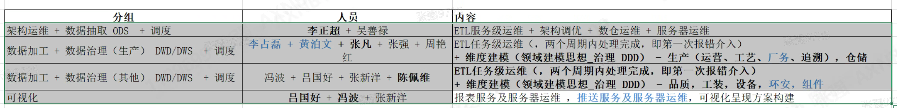

# 业务
## 报表
* 产品类型：报表产品
* 平台：帆软
* 业务范围：
  * perc电池 1-5厂 决策类和功能类的报表开发
  * ABC电池 决策类和功能类的报表开发
  * 组件 报表开发
  * 运营指标板块
* 方向：
  * 重点向ABC倾斜(六、七厂)
  * 标准化解决方案(1,2,3,5厂)
  * 组件：维持功能性开发，经营性报表开发(指标、决策报表),分析性(提供数据：单纯分析型或者自己做：能沉淀为指标)
* 组织
  * 原来：分为三大领域群组织孵化
  * 现在：2人
* 业务属性：可视化 ~~数据加工~~
## ETL
* 产品类型：ETL产品
* 平台：离线：DataX，SS(DS) 在线：SR
* 业务范围(结构化，关系型数据，日志、爬虫)：
  * perc电池 1-5厂 数据加工调度
  * ABC电池 数据加工调度
  * 组件 数据加工调度
  * 运营指标板块 数据加工调度
* 方向：数据字典，数据资产目录，数据接口->数据质量->数据治理
* 组织：
  * 原来：4人
  * 现在：7~8人
* 业务属性：数据加工、数据调度、数据治理、架构运维
# 分工

* 可视化:吕国好+冯波+张新阳(报表及报表服务器运维,推送及推送服务器运维，可视化呈现方案构建)
* 数据加工+数据治理:李占磊、黄泊文、张凡、张强、冯波、周艳红、吕国好、陈佩维、张新阳(ETL任务级运维+维度建模(领域建模思想 治理 DDD) -运营工艺厂务追溯统筹为生产，仓储，品质，工装，设备，环安)
  * 细分：生产仓储和其他
  * 生产(运营工艺厂务追溯)，仓储：李占磊、黄泊文、张凡、张强、冯波、周艳红、吕国好、陈佩维、张新阳
  * 品质，工装，设备，环安：冯波、吕国好、陈佩维、张新阳
* 架构运维+(数据抽取+调度)ODS：李正超、吴善禄(ETL服务级运维+架构调优+数仓运维+服务器运维)
# 标准
* ETL
  * 任务级运维
  * 服务级运维：两个周期内处理完成，第一次报错介入